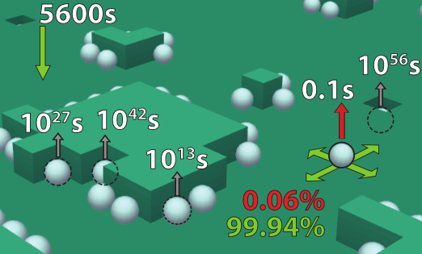

# interstellarH2
Simulation and visualization of hydrogen molecules forming on interstellar dust grains.

The simulation models astrophysical processes of adsorption of hydrogen atoms onto the rough surface of the grain, their movement, and eventual recombination into a hydrogen molecule.
These processses are treated as Poissonian events with characteristic rates.
Markov chain Monte Carlo algorithm is used to propagate the state of the system with time.

The XNA game engine is used to visualize these processes.

